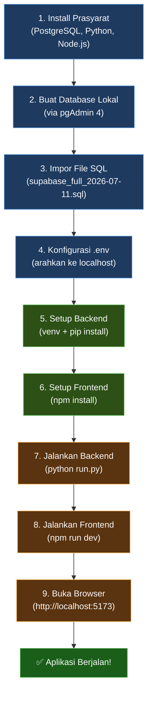
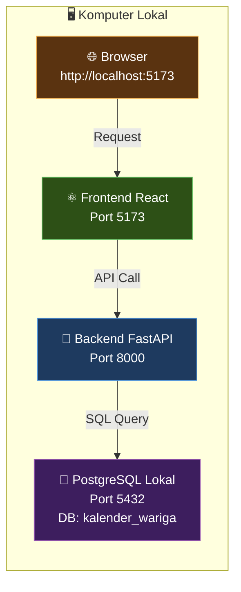

# Panduan Migrasi & Menjalankan Aplikasi Kalender Bali Wariga
## Dari Supabase Cloud → PostgreSQL Lokal (pgAdmin 4)

> [!NOTE]
> Dokumen ini ditujukan untuk **dosen penguji** atau siapa pun yang ingin menjalankan aplikasi Kalender Bali Wariga secara **100% lokal** di komputernya. Mengikuti alur ini dari awal sampai akhir akan menghasilkan aplikasi web yang **langsung bisa dicoba di browser**.

---

## 📋 Ringkasan Alur (Gambaran Besar)



---

## 🔧 Prasyarat (Software yang Harus Terinstall)

| Software | Versi Minimum | Download Link | Keterangan |
|:---|:---|:---|:---|
| **PostgreSQL** | 15+ | https://www.postgresql.org/download/windows/ | Saat install, **catat password** yang Anda set untuk user `postgres` |
| **pgAdmin 4** | 8+ | Sudah termasuk di installer PostgreSQL | GUI untuk mengelola database |
| **Python** | 3.10+ | https://www.python.org/downloads/ | ⚠️ Centang **"Add Python to PATH"** saat install |
| **Node.js** | 18+ | https://nodejs.org/ | Pilih versi **LTS** |
| **Git** | (Opsional) | https://git-scm.com/ | Hanya jika ingin clone dari repositori |

> [!IMPORTANT]
> Saat menginstall **PostgreSQL**, ingat baik-baik **password** yang Anda masukkan untuk user `postgres`. Password ini akan dibutuhkan di langkah selanjutnya.

---

## 📁 Struktur Folder Proyek

```text
kalender_wariga/
├── backend/                          ← Server API (FastAPI + Python)
│   ├── app/
│   │   ├── config.py                ← Membaca konfigurasi .env
│   │   ├── main.py                  ← Entry point FastAPI
│   │   ├── routes/                  ← Endpoint API
│   │   └── services/                ← Logika bisnis + query database
│   ├── .env                         ← ⚡ Konfigurasi koneksi database
│   ├── requirements.txt             ← Daftar library Python
│   ├── run.py                       ← Script untuk menjalankan server
│   └── verify_database.py           ← Script verifikasi database
├── frontend/                         ← Antarmuka Web (React + Vite)
│   ├── src/
│   ├── package.json
│   └── vite.config.js
├── docs/                             ← Dokumentasi arsitektur
├── supabase_full_2026-07-11.sql      ← 📦 File dump database (~163 MB)
├── migrate_to_local.bat              ← 🚀 Script migrasi otomatis
└── PANDUAN_SETUP.md                  ← Panduan setup umum
```

---

## 🚀 CARA CEPAT: Jalankan Script Otomatis

Kami sudah menyiapkan script **`migrate_to_local.bat`** yang mengotomatisasi seluruh proses.

### Sebelum Menjalankan:

1. Buka file `migrate_to_local.bat` dengan **Notepad**
2. Edit bagian **KONFIGURASI** di atas:

```bat
REM Sesuaikan dengan versi PostgreSQL Anda:
set "PGBIN=C:\Program Files\PostgreSQL\17\bin"

REM Sesuaikan dengan password PostgreSQL Anda:
set "PGPASSWORD=password_anda_disini"
```

3. **Simpan**, lalu **klik dua kali** file `migrate_to_local.bat`

Script akan otomatis:
- ✅ Membuat database `kalender_wariga`
- ✅ Mengimpor seluruh data dari file SQL
- ✅ Mengkonfigurasi file `.env`
- ✅ Setup virtual environment Python + install dependencies
- ✅ Install dependencies frontend (npm)
- ✅ Memverifikasi data di database

---

## 📖 CARA MANUAL: Langkah demi Langkah

Jika Anda lebih nyaman melakukan secara manual, ikuti langkah berikut:

---

### Langkah 1: Buat Database di pgAdmin 4

1. Buka **pgAdmin 4** (dari Start Menu)
2. Login dengan password PostgreSQL Anda
3. Di panel kiri, klik kanan **Databases** → **Create** → **Database...**
4. Isi:
   - **Database**: `kalender_wariga`
   - **Owner**: `postgres`
5. Klik **Save**


---

### Langkah 2: Impor File SQL ke Database

> [!TIP]
> Gunakan **Command Line** (bukan pgAdmin Query Tool) karena file SQL berukuran **~163 MB** — terlalu besar untuk pgAdmin Query Tool.

Buka **Command Prompt (CMD)** atau **PowerShell**, lalu navigasi ke folder proyek:

```cmd
cd "C:\path\ke\folder\kalender_wariga"
```

Jalankan perintah impor (sesuaikan path `psql` dengan versi PostgreSQL Anda):

```cmd
"C:\Program Files\PostgreSQL\17\bin\psql.exe" -U postgres -d kalender_wariga -f supabase_full_2026-07-11.sql
```

> [!NOTE]
> - Masukkan **password PostgreSQL** ketika diminta
> - Proses ini memakan waktu **2-10 menit** tergantung spesifikasi komputer
> - Beberapa **NOTICE** atau **WARNING** adalah **NORMAL** dan bisa diabaikan (ini karena file dump Supabase mengandung perintah khusus Supabase yang tidak berlaku di PostgreSQL lokal)

#### Path `psql` Sesuai Versi PostgreSQL:

| Versi PostgreSQL | Path `psql.exe` |
|:---|:---|
| PostgreSQL 15 | `C:\Program Files\PostgreSQL\15\bin\psql.exe` |
| PostgreSQL 16 | `C:\Program Files\PostgreSQL\16\bin\psql.exe` |
| PostgreSQL 17 | `C:\Program Files\PostgreSQL\17\bin\psql.exe` |
| PostgreSQL 18 | `C:\Program Files\PostgreSQL\18\bin\psql.exe` |

---

### Langkah 3: Verifikasi Data di pgAdmin

Setelah impor selesai, pastikan data sudah masuk:

1. Di pgAdmin, klik kanan database **kalender_wariga** → **Query Tool**
2. Jalankan query berikut satu per satu:

```sql
SELECT 'kalender_bali' AS tabel, count(*) AS jumlah FROM kalender_bali
UNION ALL
SELECT 'kalender_dawuh', count(*) FROM kalender_dawuh
UNION ALL
SELECT 'dewasa', count(*) FROM dewasa
UNION ALL
SELECT 'daftar_wariga', count(*) FROM daftar_wariga
UNION ALL
SELECT 'pebayuhan', count(*) FROM pebayuhan
UNION ALL
SELECT 'makna_4aspek', count(*) FROM makna_4aspek
UNION ALL
SELECT 'keterangan_wuku', count(*) FROM keterangan_wuku
UNION ALL
SELECT 'keterangan_pancawara_saptawara', count(*) FROM keterangan_pancawara_saptawara
UNION ALL
SELECT 'knowledge_documents', count(*) FROM knowledge_documents
UNION ALL
SELECT 'knowledge_chunks', count(*) FROM knowledge_chunks;
```

**Hasil yang diharapkan:**

| Tabel | Jumlah Baris |
|:---|---:|
| `kalender_bali` | 29.219 |
| `kalender_dawuh` | 29.219 |
| `dewasa` | 29.219 |
| `daftar_wariga` | 55 |
| `pebayuhan` | 35 |
| `makna_4aspek` | 35 |
| `keterangan_wuku` | 30 |
| `keterangan_pancawara_saptawara` | 7 |
| `knowledge_documents` | 2 |
| `knowledge_chunks` | 5 |

---

### Langkah 4: Konfigurasi File `.env` Backend

Buka file `backend\.env` dengan Notepad:

```cmd
notepad backend\.env
```

Ubah **5 baris pertama** menjadi:

```env
DB_USER=postgres
DB_PASSWORD=password_postgres_anda
DB_HOST=127.0.0.1
DB_PORT=5432
DB_NAME=kalender_wariga
```

> [!IMPORTANT]
> Ganti `password_postgres_anda` dengan password yang Anda set saat install PostgreSQL. **Baris lainnya (API key, dll.) jangan diubah.**

---

### Langkah 5: Setup & Jalankan Backend

Buka **Terminal/CMD baru** (Terminal 1):

```cmd
cd "C:\path\ke\folder\kalender_wariga\backend"

REM Buat virtual environment (hanya pertama kali)
python -m venv venv

REM Aktifkan virtual environment
venv\Scripts\activate

REM Install dependencies
pip install -r requirements.txt

REM Jalankan server backend
python run.py
```

Jika berhasil, akan muncul pesan:
```
INFO:     Uvicorn running on http://127.0.0.1:8000
INFO:     Application startup complete.
```

> [!CAUTION]
> **Jangan tutup terminal ini!** Biarkan terminal backend tetap berjalan.

---

### Langkah 6: Setup & Jalankan Frontend

Buka **Terminal/CMD baru lagi** (Terminal 2):

```cmd
cd "C:\path\ke\folder\kalender_wariga\frontend"

REM Install dependencies (hanya pertama kali)
npm install

REM Jalankan development server
npm run dev
```

Jika berhasil, akan muncul pesan:
```
  VITE v6.x.x  ready in xxx ms

  ➜  Local:   http://localhost:5173/
```

---

### Langkah 7: Buka di Browser 🎉

Buka browser dan akses: **http://localhost:5173**



---

## 🔍 Verifikasi Tambahan (Opsional)

### Verifikasi via Script Python

Setelah setup backend selesai, Anda bisa menjalankan script verifikasi otomatis:

```cmd
cd backend
venv\Scripts\activate
python verify_database.py
```

Script ini akan mengecek:
- ✅ Koneksi ke database PostgreSQL lokal
- ✅ Semua tabel ada dan berisi data
- ✅ Query-query utama aplikasi berjalan normal

### Verifikasi via Browser (API Docs)

Buka: **http://127.0.0.1:8000/docs**

Ini akan menampilkan **Swagger UI** dari FastAPI, di mana Anda bisa langsung mencoba setiap endpoint API.

**Endpoint yang bisa dicoba:**
| Endpoint | Method | Kegunaan |
|:---|:---|:---|
| `/api/dashboard/date/2025-07-15` | GET | Ambil data kalender hari ini |
| `/api/calendar/date/2025-01-01` | GET | Detail kalender per tanggal |
| `/api/calendar/month/2025/7` | GET | Kalender per bulan |
| `/api/dewasa-ayu/date/2025-07-15` | GET | Data dewasa ayu |
| `/` | GET | Cek backend berjalan |

---

## ❓ Troubleshooting (Solusi Masalah Umum)

### 1. `'psql' is not recognized`
**Penyebab:** Path `psql` tidak ditemukan.
**Solusi:** Gunakan full path, contoh:
```cmd
"C:\Program Files\PostgreSQL\17\bin\psql.exe" -U postgres -d kalender_wariga -f supabase_full_2026-07-11.sql
```

### 2. `password authentication failed for user "postgres"`
**Penyebab:** Password di `.env` tidak cocok dengan password PostgreSQL.
**Solusi:** Buka `backend\.env`, pastikan `DB_PASSWORD` sesuai dengan password yang Anda set saat install PostgreSQL.

### 3. `connection refused` atau `could not connect to server`
**Penyebab:** PostgreSQL service tidak berjalan.
**Solusi:**
1. Buka **Services** (tekan `Win+R`, ketik `services.msc`)
2. Cari **postgresql-x64-17** (sesuaikan versi)
3. Klik kanan → **Start**

### 4. `FATAL: database "kalender_wariga" does not exist`
**Penyebab:** Database belum dibuat.
**Solusi:** Buat database dulu via pgAdmin (Langkah 1) atau jalankan:
```cmd
"C:\Program Files\PostgreSQL\17\bin\createdb.exe" -U postgres kalender_wariga
```

### 5. `ModuleNotFoundError: No module named 'xxx'`
**Penyebab:** Virtual environment tidak aktif atau dependencies belum diinstall.
**Solusi:**
```cmd
cd backend
venv\Scripts\activate
pip install -r requirements.txt
```

### 6. Frontend menampilkan error atau blank
**Penyebab:** Backend belum berjalan atau dependencies frontend belum diinstall.
**Solusi:**
1. Pastikan backend **sudah berjalan** di terminal lain (`python run.py`)
2. Pastikan dependencies frontend sudah diinstall (`npm install`)
3. Jalankan ulang frontend (`npm run dev`)

### 7. Error NOTICE saat impor SQL
**Ini NORMAL!** File dump dari Supabase mengandung perintah khusus (extension, role, dsb) yang tidak berlaku di PostgreSQL lokal. Selama data berhasil masuk (cek via verifikasi), error/notice ini bisa diabaikan.

---

## 📊 Ringkasan Arsitektur Koneksi

| Komponen | Koneksi Ke | Keterangan |
|:---|:---|:---|
| **Browser** | `http://localhost:5173` | Antarmuka web yang dilihat pengguna |
| **Frontend (React)** | `http://127.0.0.1:8000` | Mengirim request API ke backend |
| **Backend (FastAPI)** | `postgresql://127.0.0.1:5432/kalender_wariga` | Query data dari database lokal |
| **Database (PostgreSQL)** | — | Menyimpan seluruh data kalender Wariga |

> [!TIP]
> Frontend mengetahui alamat backend dari file `frontend/src/services/api.js`. Default-nya sudah mengarah ke `http://127.0.0.1:8000`, jadi **tidak perlu diubah** untuk penggunaan lokal.
