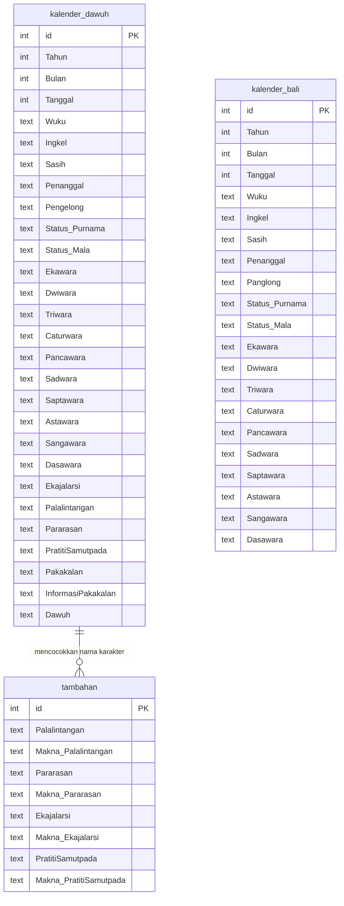

# Arsitektur Database Kalender Bali Wariga

## 1. Gambaran Umum

Database yang dipakai aplikasi Kalender Bali Wariga saat ini adalah PostgreSQL.
Backend mengakses database melalui SQLAlchemy pada file `backend/app/services/database.py`.

Tabel yang digunakan aplikasi:

- `kalender_dawuh`
- `kalender_bali`
- `tambahan`

Tiga tabel tersebut dipakai untuk fitur:

- Dashboard kalender.
- Detail kalender per tanggal.
- Kalender per bulan.
- Karakter kelahiran.
- Generate kalender.
- Tanya Wariga AI.

Ringkasan penggunaan tabel per fitur:

| Fitur | Tabel database yang dipakai |
| --- | --- |
| Dashboard | `kalender_dawuh` |
| Kalender per tanggal | `kalender_dawuh` + `tambahan` |
| Kalender per bulan | `kalender_dawuh` + `tambahan` |
| Karakter kelahiran | `kalender_dawuh` + `tambahan` |
| Generate kalender | `kalender_dawuh` + `tambahan` |
| Tanya Wariga AI | `kalender_dawuh` + `kalender_bali` |

Catatan: karakter kelahiran dan generate kalender tetap memakai `kalender_dawuh` karena nama karakter harian tersimpan di tabel tersebut, sedangkan tabel `tambahan` dipakai untuk mengambil maknanya.

## 2. Diagram Database



Catatan: relasi `kalender_dawuh` ke `tambahan` bukan foreign key fisik. Backend mencocokkan data berdasarkan isi teks kolom, misalnya nilai `Palalintangan` pada `kalender_dawuh` dicari maknanya di tabel `tambahan`.

## 3. Tabel `kalender_dawuh`

Tabel `kalender_dawuh` adalah tabel utama untuk data kalender Wariga yang lebih lengkap.

Dipakai oleh:

- `backend/app/services/kalender_service.py`
- `backend/app/routes/calendar_routes.py`
- `backend/app/routes/dashboard_routes.py`
- `backend/app/routes/generate_routes.py`
- `backend/app/services/chat_context_service.py`

Fungsi utama:

- Mengambil data kalender berdasarkan tanggal.
- Mengambil data kalender berdasarkan bulan.
- Mengambil data kalender berdasarkan rentang tanggal.
- Menyediakan data karakter kelahiran.
- Menyediakan data pakakalan, baik-buruk hari, dan dawuh.

Struktur kolom:

| Kolom | Tipe | Keterangan |
| --- | --- | --- |
| `id` | `bigserial` | Primary key. |
| `Tahun` | `integer` | Tahun masehi. |
| `Bulan` | `integer` | Bulan masehi. |
| `Tanggal` | `integer` | Tanggal masehi. |
| `Wuku` | `text` | Nama wuku. |
| `Ingkel` | `text` | Nama ingkel. |
| `Sasih` | `text` | Nama sasih. |
| `Penanggal` | `text` | Nilai penanggal. |
| `Pengelong` | `text` | Nilai pengelong. |
| `Status_Purnama` | `text` | Status Purnama atau Tilem. |
| `Status_Mala` | `text` | Status mala. |
| `Ekawara` | `text` | Data ekawara. |
| `Dwiwara` | `text` | Data dwiwara. |
| `Triwara` | `text` | Data triwara. |
| `Caturwara` | `text` | Data caturwara. |
| `Pancawara` | `text` | Data pancawara. |
| `Sadwara` | `text` | Data sadwara. |
| `Saptawara` | `text` | Data saptawara. |
| `Astawara` | `text` | Data astawara. |
| `Sangawara` | `text` | Data sangawara. |
| `Dasawara` | `text` | Data dasawara. |
| `Ekajalarsi` | `text` | Data karakter kelahiran. |
| `Palalintangan` | `text` | Data karakter kelahiran. |
| `Pararasan` | `text` | Data karakter kelahiran. |
| `PratitiSamutpada` | `text` | Data karakter kelahiran. |
| `Pakakalan` | `text` | Nama pakakalan. |
| `InformasiPakakalan` | `text` | Informasi baik-buruk hari. |
| `Dawuh` | `text` | Informasi dawuh. |

Query utama yang dipakai backend:

```sql
SELECT *
FROM kalender_dawuh
WHERE "Tahun" = :tahun
  AND "Bulan" = :bulan
  AND "Tanggal" = :tanggal;
```

```sql
SELECT *
FROM kalender_dawuh
WHERE "Tahun" = :tahun
  AND "Bulan" = :bulan
ORDER BY "Tanggal";
```

```sql
SELECT *
FROM kalender_dawuh
WHERE ("Tahun", "Bulan", "Tanggal")
      BETWEEN (:start_year, :start_month, :start_day)
          AND (:end_year, :end_month, :end_day)
ORDER BY "Tahun", "Bulan", "Tanggal";
```

## 4. Tabel `kalender_bali`

Tabel `kalender_bali` menyimpan data kalender Bali dasar.

Dipakai oleh:

- `backend/app/services/kalender_bali_service.py`
- `backend/app/services/chat_context_service.py`

Fungsi utama:

- Mengambil kalender Bali berdasarkan tanggal.
- Mengambil kalender Bali berdasarkan bulan.
- Menjadi konteks tambahan untuk Tanya Wariga AI.

Struktur kolom:

| Kolom | Tipe | Keterangan |
| --- | --- | --- |
| `id` | `bigserial` | Primary key. |
| `Tahun` | `integer` | Tahun masehi. |
| `Bulan` | `integer` | Bulan masehi. |
| `Tanggal` | `integer` | Tanggal masehi. |
| `Wuku` | `text` | Nama wuku. |
| `Ingkel` | `text` | Nama ingkel. |
| `Sasih` | `text` | Nama sasih. |
| `Penanggal` | `text` | Nilai penanggal. |
| `Panglong` | `text` | Nilai panglong. |
| `Status_Purnama` | `text` | Status Purnama atau Tilem. |
| `Status_Mala` | `text` | Status mala. |
| `Ekawara` | `text` | Data ekawara. |
| `Dwiwara` | `text` | Data dwiwara. |
| `Triwara` | `text` | Data triwara. |
| `Caturwara` | `text` | Data caturwara. |
| `Pancawara` | `text` | Data pancawara. |
| `Sadwara` | `text` | Data sadwara. |
| `Saptawara` | `text` | Data saptawara. |
| `Astawara` | `text` | Data astawara. |
| `Sangawara` | `text` | Data sangawara. |
| `Dasawara` | `text` | Data dasawara. |

Query utama yang dipakai backend:

```sql
SELECT *
FROM kalender_bali
WHERE "Tahun" = :tahun
  AND "Bulan" = :bulan
  AND "Tanggal" = :tanggal;
```

```sql
SELECT *
FROM kalender_bali
WHERE "Tahun" = :tahun
  AND "Bulan" = :bulan
ORDER BY "Tanggal";
```

## 5. Tabel `tambahan`

Tabel `tambahan` menyimpan makna dari data karakter kelahiran.

Dipakai oleh:

- `backend/app/services/kalender_service.py`

Fungsi utama:

- Memberikan makna `Palalintangan`.
- Memberikan makna `Pararasan`.
- Memberikan makna `Ekajalarsi`.
- Memberikan makna `PratitiSamutpada`.
- Membentuk teks `karakter_kelahiran` pada response API.

Struktur kolom:

| Kolom | Tipe | Keterangan |
| --- | --- | --- |
| `id` | `bigserial` | Primary key. |
| `Palalintangan` | `text` | Nama Palalintangan. |
| `Makna_Palalintangan` | `text` | Makna Palalintangan. |
| `Pararasan` | `text` | Nama Pararasan. |
| `Makna_Pararasan` | `text` | Makna Pararasan. |
| `Ekajalarsi` | `text` | Nama Ekajalarsi. |
| `Makna_Ekajalarsi` | `text` | Makna Ekajalarsi. |
| `PratitiSamutpada` | `text` | Nama Pratiti Samutpada. |
| `Makna_PratitiSamutpada` | `text` | Makna Pratiti Samutpada. |

Query utama yang dipakai backend:

```sql
SELECT *
FROM tambahan;
```

Backend mengambil semua baris dari `tambahan`, lalu mencocokkan nama karakter dengan data dari `kalender_dawuh`.

## 6. Alur Data Database

### Dashboard

```text
Dashboard.jsx
  -> GET /api/dashboard/date/{tanggal}
  -> dashboard_routes.py
  -> kalender_service.py
  -> kalender_dawuh
```

Pada bagian Dashboard, data yang ditampilkan diambil dari tabel `kalender_dawuh`, seperti informasi wewaran, wuku, sasih, purnama/tilem, pakakalan, baik-buruk hari, dan dawuh.

### Kalender per Tanggal

```text
Frontend
  -> GET /api/calendar/date/{tanggal}
  -> calendar_routes.py
  -> kalender_service.py
  -> kalender_dawuh
  -> tambahan
```

### Kalender per Bulan

```text
Frontend
  -> GET /api/calendar/month/{tahun}/{bulan}
  -> calendar_routes.py
  -> kalender_service.py
  -> kalender_dawuh
  -> tambahan
```

### Karakter Kelahiran

```text
Frontend
  -> GET /api/calendar/date/{tanggal}
  -> kalender_dawuh mengambil data Palalintangan, Pararasan, Ekajalarsi, PratitiSamutpada
  -> tambahan mengambil makna karakter
  -> backend membentuk karakter_kelahiran
```

Tabel yang dipakai: `kalender_dawuh` dan `tambahan`.

### Generate Kalender

```text
Frontend
  -> POST /api/generate/kalender
  -> generate_routes.py
  -> kalender_service.py
  -> kalender_dawuh mengambil data berdasarkan rentang tanggal
  -> tambahan mengambil makna karakter
  -> backend membentuk hasil kalender
```

Tabel yang dipakai: `kalender_dawuh` dan `tambahan`.

### Tanya Wariga AI

```text
TanyaWarigaAI.jsx
  -> POST /api/chat
  -> chat_context_service.py
  -> kalender_dawuh
  -> kalender_bali
  -> data dipakai sebagai konteks jawaban AI
```

## 7. SQL DDL Database yang Dipakai

```sql
CREATE TABLE IF NOT EXISTS kalender_dawuh (
    id BIGSERIAL PRIMARY KEY,
    "Tahun" INTEGER NOT NULL,
    "Bulan" INTEGER NOT NULL,
    "Tanggal" INTEGER NOT NULL,
    "Wuku" TEXT,
    "Ingkel" TEXT,
    "Sasih" TEXT,
    "Penanggal" TEXT,
    "Pengelong" TEXT,
    "Status_Purnama" TEXT,
    "Status_Mala" TEXT,
    "Ekawara" TEXT,
    "Dwiwara" TEXT,
    "Triwara" TEXT,
    "Caturwara" TEXT,
    "Pancawara" TEXT,
    "Sadwara" TEXT,
    "Saptawara" TEXT,
    "Astawara" TEXT,
    "Sangawara" TEXT,
    "Dasawara" TEXT,
    "Ekajalarsi" TEXT,
    "Palalintangan" TEXT,
    "Pararasan" TEXT,
    "PratitiSamutpada" TEXT,
    "Pakakalan" TEXT,
    "InformasiPakakalan" TEXT,
    "Dawuh" TEXT,
    CONSTRAINT kalender_dawuh_unique_date UNIQUE ("Tahun", "Bulan", "Tanggal")
);

CREATE INDEX IF NOT EXISTS idx_kalender_dawuh_tanggal
ON kalender_dawuh ("Tahun", "Bulan", "Tanggal");

CREATE TABLE IF NOT EXISTS kalender_bali (
    id BIGSERIAL PRIMARY KEY,
    "Tahun" INTEGER NOT NULL,
    "Bulan" INTEGER NOT NULL,
    "Tanggal" INTEGER NOT NULL,
    "Wuku" TEXT,
    "Ingkel" TEXT,
    "Sasih" TEXT,
    "Penanggal" TEXT,
    "Panglong" TEXT,
    "Status_Purnama" TEXT,
    "Status_Mala" TEXT,
    "Ekawara" TEXT,
    "Dwiwara" TEXT,
    "Triwara" TEXT,
    "Caturwara" TEXT,
    "Pancawara" TEXT,
    "Sadwara" TEXT,
    "Saptawara" TEXT,
    "Astawara" TEXT,
    "Sangawara" TEXT,
    "Dasawara" TEXT,
    CONSTRAINT kalender_bali_unique_date UNIQUE ("Tahun", "Bulan", "Tanggal")
);

CREATE INDEX IF NOT EXISTS idx_kalender_bali_tanggal
ON kalender_bali ("Tahun", "Bulan", "Tanggal");

CREATE TABLE IF NOT EXISTS tambahan (
    id BIGSERIAL PRIMARY KEY,
    "Palalintangan" TEXT,
    "Makna_Palalintangan" TEXT,
    "Pararasan" TEXT,
    "Makna_Pararasan" TEXT,
    "Ekajalarsi" TEXT,
    "Makna_Ekajalarsi" TEXT,
    "PratitiSamutpada" TEXT,
    "Makna_PratitiSamutpada" TEXT
);
```

## 8. Ringkasan

| Tabel | Dipakai untuk |
| --- | --- |
| `kalender_dawuh` | Dashboard, kalender per tanggal/bulan, generate kalender, dawuh, pakakalan, baik-buruk hari, dan data nama karakter kelahiran. |
| `kalender_bali` | Data kalender Bali dasar untuk lookup tanggal dan konteks Tanya Wariga AI. |
| `tambahan` | Makna karakter kelahiran yang digabungkan dengan data dari `kalender_dawuh`. |
