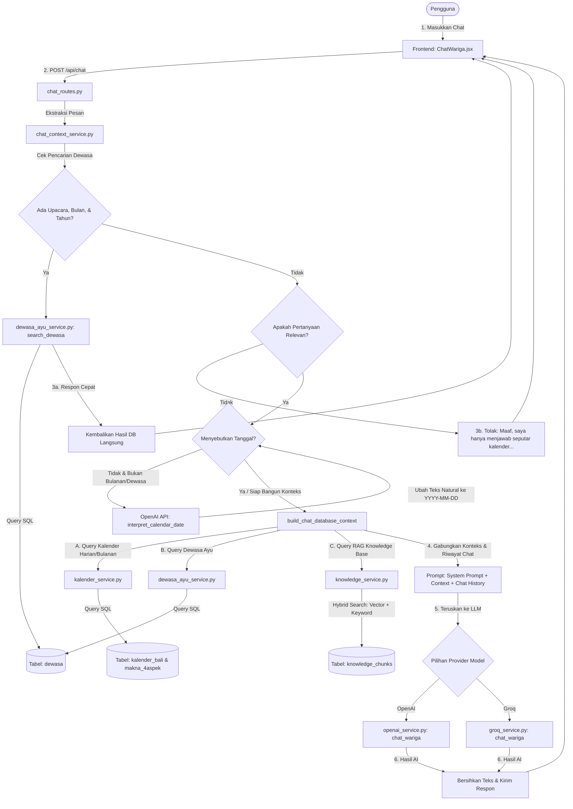

# Arsitektur Sistem Kalender Bali Wariga & Chatbot AI

Dokumen ini menjelaskan arsitektur keseluruhan proyek **Kalender Bali Wariga** serta menyajikan detail mendalam mengenai sistem chatbot **Tanya Wariga AI** yang merupakan fitur inti dalam integrasi kecerdasan buatan (AI) dengan pengetahuan tradisional Bali.

---

## 1. Gambaran Umum Sistem

Aplikasi **Kalender Bali Wariga** dibangun menggunakan arsitektur client-server modern (Three-Tier Architecture) yang memisahkan antara antarmuka pengguna, logika bisnis/layanan, dan penyimpanan data.

```text
+-----------------------+      HTTP API      +-------------------------+
|    CLIENT LAYER       |   ------------->   |      BACKEND LAYER      |
|  React (Vite) App     |   <-------------   |   FastAPI REST Service  |
+-----------------------+      JSON Resp     +-------------------------+
                                                          |
                                          +---------------+---------------+
                                          |                               |
                                          v                               v
                              +-----------------------+       +-----------------------+
                              |    DATABASE LAYER     |       |    AI GATEWAY LAYER   |
                              |  PostgreSQL/Supabase  |       |  OpenAI & Groq APIs   |
                              +-----------------------+       +-----------------------+
```

1. **Client Layer (Frontend)**: Aplikasi berbasis React yang dibundel menggunakan Vite. Mengelola interaksi pengguna seperti kalender interaktif, filter Dewasa Ayu, cetak kalender, dan antarmuka chat.
2. **Application Layer (Backend)**: API RESTful berbasis FastAPI (Python) yang memproses request, melakukan penghitungan wariga harian/bulanan, dan mengatur pembuatan konteks untuk chatbot.
3. **Database Layer (Penyimpanan)**: PostgreSQL (diinangi di Supabase atau lokal) untuk menyimpan data kalender Bali, tabel makna/deskripsi tambahan, data Dewasa Ayu, dokumen knowledge base, dan potongan dokumen (chunks).
4. **AI Gateway Layer**: Integrasi dengan OpenAI API (untuk model Embedding `text-embedding-3-small` atau sejenisnya, interpretasi tanggal, dan model GPT) serta Groq API (untuk chat berlatensi rendah menggunakan model Llama/Mixtral).

---

## 2. Arsitektur Chatbot Tanya Wariga AI

Fitur **Tanya Wariga AI** menggunakan teknik **Retrieval-Augmented Generation (RAG)** hibrida serta **klasifikasi intent** sebelum data dikirim ke model LLM. Hal ini memastikan model hanya menjawab berdasarkan fakta tepercaya yang bersumber dari database kalender dan dokumen tradisi Bali.

### Diagram Alur Pemrosesan Chatbot



### Komponen Utama Chatbot

1.  **Intent Classifier & Guardrail ([chat_context_service.py:is_calendar_question](file:///c:/Users/Ceditt/Documents/A-KULIAH/SEMESTER-6/DSP/kalender_bali/kalender_wariga/backend/app/services/chat_context_service.py#L548))**:
    Mengevaluasi pesan user dengan membandingkannya terhadap daftar kata kunci global `CALENDAR_KEYWORDS` (seperti *wuku, sasih, wewaran, melukat, tenung*). Jika pertanyaan tidak memiliki kaitan dengan Kalender Bali, Wariga, atau knowledge base tradisi, backend langsung mengembalikan teks penolakan terprogram tanpa memanggil API LLM untuk menghemat biaya dan menjaga perilaku bot.
2.  **NLP Date Interpreter ([openai_service.py:interpret_calendar_date](file:///c:/Users/Ceditt/Documents/A-KULIAH/SEMESTER-6/DSP/kalender_bali/kalender_wariga/backend/app/services/openai_service.py#L74))**:
    Mendeteksi tanggal yang disebutkan secara kasual/informal dalam pesan user (contoh: *"hari senin depan"*, *"wuku apa lusa?"*). System memanggil OpenAI dengan instruksi khusus untuk mengekstrak dan mengonversi input natural tersebut menjadi format standar `YYYY-MM-DD`.
3.  **Fast Path Dewasa Ayu ([chat_context_service.py:build_dewasa_direct_answer](file:///c:/Users/Ceditt/Documents/A-KULIAH/SEMESTER-6/DSP/kalender_bali/kalender_wariga/backend/app/services/chat_context_service.py#L478))**:
    Jika pesan pengguna terdeteksi mencari dewasa ayu untuk upacara tertentu (contoh: *"melaspas"*) pada periode tertentu (contoh: *"Juni 2026"*), backend langsung mengambil data dari database dewasa ayu dan mengemas hasilnya menjadi teks siap pakai. Alur ini melewati LLM sepenuhnya, mempercepat respon (*zero-latency LLM*) dan menghemat token.
4.  **RAG Hybrid Search Engine ([knowledge_service.py:search_knowledge](file:///c:/Users/Ceditt/Documents/A-KULIAH/SEMESTER-6/DSP/kalender_bali/kalender_wariga/backend/app/services/knowledge_service.py#L307))**:
    Menangani kueri umum seputar tradisi Bali (seperti penglukatan, tenung, pembayuhan, permata, dll.). Sistem menggunakan pencarian hibrida yang menggabungkan:
    *   **Vector Search**: Menghitung *Cosine Similarity* antara embedding pertanyaan pengguna dengan embedding teks dokumen yang disimpan di PostgreSQL.
    *   **Keyword Overlap**: Menghitung rasio kesamaan kata kunci (*token overlap*) antara kueri dan konten teks.
    *   Skor Akhir: `score = vector_score + keyword_score`. 5 potongan teks dokumen dengan skor tertinggi kemudian dikirim ke LLM sebagai referensi utama.

---

## 3. Detail Kategori Pertanyaan & Alur Kode Pencarian Data

Aplikasi chatbot secara terstruktur memetakan pertanyaan pengguna ke database relasional PostgreSQL melalui beberapa modul backend Python. Berikut adalah daftar jenis pertanyaan dan pemetaan datanya:

### A. Pertanyaan Kalender Harian (Daily Info)
*   **Pertanyaan Pengguna**: *"Bagaimana detail kalender tanggal 22 Juni 2026?"*, *"Karakter kelahiran orang lahir besok"*, *"Pakakalan hari ini"*
*   **Dataset & Tabel**:
    *   `kalender_bali`: Menyimpan data penanggalan Bali harian.
    *   `makna_4aspek`: Menyimpan teks deskripsi makna/arti penanggalan.
*   **Pemetaan Kolom**:
    *   *Kueri*: `Tahun`, `Bulan`, `Tanggal`.
    *   *Wewaran*: `Ekawara`, `Dwiwara`, `Triwara`, `Caturwara`, `Pancawara`, `Sadwara`, `Saptawara`, `Astawara`, `Sangawara`, `Dasawara`.
    *   *Elemen Kalender Bali*: `Wuku`, `Ingkel`, `Sasih`, `Penanggal`, `Pengelong`, `Status_Mala`, `Status_Purnama`, `Nyepi`, `piodalan`.
    *   *Karakter Kelahiran*: `Palalintangan`, `Pararasan`, `PratitiSamutpada`, `Ekajalarsi`. Kolom ini dicocokkan ke tabel `makna_4aspek` untuk mengambil kolom makna seperti `Makna_Palalintangan` dan `Makna_Ekajalarsi`.
*   **Alur Kode**:
    1.  User mengirim pesan $\rightarrow$ backend mengekstraksi tanggal target (misal: `2026-06-22`) melalui fungsi `extract_latest_date`.
    2.  Memanggil `get_kalender_by_date` di [kalender_service.py](file:///c:/Users/Ceditt/Documents/A-KULIAH/SEMESTER-6/DSP/kalender_bali/kalender_wariga/backend/app/services/kalender_service.py#L327) untuk mengambil data dari tabel `kalender_bali` dan `makna_4aspek`.
    3.  Data mentah di-parse menggunakan fungsi `parse_row` untuk memformat data lunar, urip angka, dan menggabungkan teks penjelasan karakter kelahiran.
    4.  Hasil parsing dimasukkan sebagai format JSON ke dalam prompt LLM.

### B. Pertanyaan Kalender Bulanan (Monthly Events/Hari Raya)
*   **Pertanyaan Pengguna**: *"Apa saja hari raya di bulan Juni 2026?"*, *"Tampilkan daftar libur nasional Oktober 2026"*
*   **Dataset & Tabel**: `kalender_bali`.
*   **Pemetaan Kolom**:
    *   *Kueri*: `Tahun`, `Bulan`.
    *   *Filter Bidang*:
        *   Hari Raya Hindu: kolom `harikeagamaan`, `status_purnama`, `kajengkliwon`, `Nyepi`.
        *   Hari Libur Nasional: kolom `harinonbali`.
        *   Piodalan Pura: kolom `piodalan`.
*   **Alur Kode**:
    1.  Backend mendeteksi kata kunci bulanan (misal: *"Juni 2026"* $\rightarrow$ `month=6`, `year=2026`) menggunakan fungsi `get_month_year_from_text`.
    2.  Mengidentifikasi jenis kolom target menggunakan `resolve_monthly_calendar_field`.
    3.  Memanggil `get_kalender_by_month(year, month)` di [kalender_service.py](file:///c:/Users/Ceditt/Documents/A-KULIAH/SEMESTER-6/DSP/kalender_bali/kalender_wariga/backend/app/services/kalender_service.py#L337) yang mengeksekusi query SQL:
        ```sql
        SELECT * FROM kalender_bali WHERE "Tahun" = :tahun AND "Bulan" = :bulan ORDER BY "Tanggal"
        ```
    4.  Backend menyaring tanggal yang memiliki nilai event pada kolom tersebut, mengemasnya menjadi baris terformat, dan menyematkannya ke dalam `monthly_calendar_context`.

### C. Kueri Dewasa Ayu (Auspicious Days)
*   **Pertanyaan Pengguna**: *"Kapan hari baik untuk Melaspas di bulan Juni 2026?"*, *"Hari buruk untuk pernikahan di tahun 2026"*
*   **Dataset & Tabel**: `dewasa`.
*   **Pemetaan Kolom**:
    *   *Kueri*: `tanggal` (pencocokan pola `LIKE 'YYYY-MM-%'`).
    *   *Kueri JSON (`dewasa`)*: Kolom `dewasa` bertipe teks terformat JSON List. Backend menyaring list tersebut berdasarkan kunci `jenis_yadnya` (misal: *Dewa Yadnya*) dan `upacara` (misal: *Melaspas*).
    *   *Evaluasi Status*: Di dalam list `rules_match`, sistem membaca nilai kolom `status` (*"Baik"*, *"Ala-Ayu"*, *"Buruk"*).
*   **Alur Kode**:
    1.  Mencocokkan kata kunci upacara dengan daftar upacara resmi dalam database melalui `resolve_dewasa_ceremony`.
    2.  Mengambil filter bulan dan tahun pencarian dari teks.
    3.  Memanggil `search_dewasa` di [dewasa_ayu_service.py](file:///c:/Users/Ceditt/Documents/A-KULIAH/SEMESTER-6/DSP/kalender_bali/kalender_wariga/backend/app/services/dewasa_ayu_service.py#L166) yang mengeksekusi query SQL:
        ```sql
        SELECT tanggal, wewaran, dewasa FROM dewasa WHERE tanggal LIKE :month_prefix ORDER BY tanggal
        ```
    4.  Fungsi backend men-deserialize teks string JSON dari kolom `dewasa` dan mengelompokkan hari-hari yang cocok ke dalam kategori `ayu` (baik), `dipakai` (biasa saja), dan `ala` (buruk).
    5.  Jika data pencarian lengkap, hasil langsung dikirim tanpa memproses LLM. Jika tidak lengkap, dikirim sebagai `dewasa_context` ke LLM.

### D. RAG Pengetahuan Adat (Knowledge Base)
*   **Pertanyaan Pengguna**: *"Jelaskan tentang melukat"*, *"Apa arti tenung kelahiran?"*, *"Apa isi lontar wariga?"*
*   **Dataset & Tabel**: `knowledge_documents` (metadata dokumen) dan `knowledge_chunks` (potongan teks dan embedding).
*   **Pemetaan Kolom**:
    *   *Pencarian Vektor*: `embedding` (kolom bertipe text JSON representation dari vektor 1536 dimensi).
    *   *Pencarian Teks*: `content` (potongan konten teks dokumen).
    *   *Metadata*: `category`, `title`, `source_filename`.
*   **Alur Kode**:
    1.  Pertanyaan pengguna diubah menjadi vektor embedding menggunakan model OpenAI (`request_openai_embeddings`).
    2.  Backend memuat daftar chunk terbaru (maksimal 800 chunks) dari database.
    3.  Backend menghitung Cosine Similarity secara manual antara vektor pertanyaan dengan setiap vektor embedding chunk di database.
    4.  Backend menghitung kecocokan kata kunci dengan membagi jumlah token kata yang sama antara pertanyaan dan teks chunk.
    5.  Kedua skor digabungkan, diurutkan, dan 5 potongan dokumen terbaik disisipkan sebagai referensi tambahan (`knowledge_context`) dalam prompt LLM.

---

## 4. Struktur File & Folder Terkait Chatbot

Berikut adalah file-file penting yang menyusun fungsionalitas Chatbot AI pada proyek ini:

```text
kalender_wariga/
├── frontend/
│   └── src/
│       ├── components/
│       │   └── ChatWariga.jsx          # Komponen UI Chatbot & antarmuka pesan
│       └── services/
│           └── chatApi.js              # Service pemanggilan API POST /api/chat
│
└── backend/
    └── app/
        ├── routes/
        │   └── chat_routes.py          # HTTP Router FastAPI penentu alur chat
        └── services/
            ├── chat_context_service.py # Logika ekstraksi tanggal, klasifikasi kueri, dan pembangunan konteks
            ├── kalender_service.py     # Logika pengambilan data kalender bali harian/bulanan
            ├── dewasa_ayu_service.py   # Logika pemfilteran hari baik/buruk di database dewasa
            ├── knowledge_service.py    # Logika RAG, pembuatan embedding, dan pencarian hybrid search
            ├── openai_service.py       # Gateway pemanggilan API OpenAI (Chat & Embeddings)
            └── groq_service.py         # Gateway pemanggilan API Groq (Chat berlatensi rendah)
```
